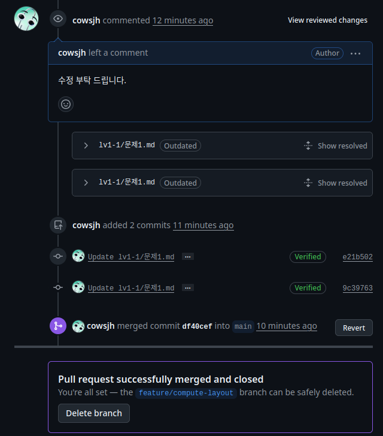
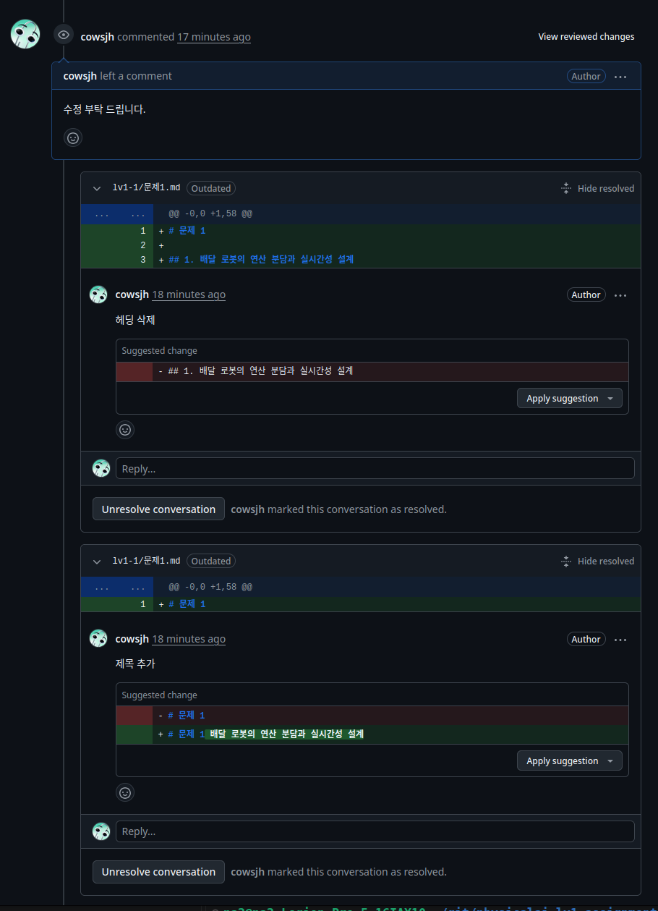

# 문제 1

## 배달 로봇 부품 사양 (주어진 값)

| 부품       | 주기        | 지연 예산   | 초당 데이터 크기 | 데이터 타입                    | 비고                                          |
| -------- | --------- | ------- | --------- | ------------------------- | ------------------------------------------- |
| 2D Lidar | 15hz      | 66.7ms  | 0.48mbps  | sensor_msgs/LaserScan     | float32 range / 1000샘플·스캔 → 초당 15000 샘플     |
| 카메라      | 720p60fps | 16.67ms | 1327mbps  | sensor_msgs/Image.msg     | RGB raw 8bit → 165.9 MB/s                    |
| IMU      | 400hz     | 2.5ms   | 0.947mbps | sensor_msgs/Imu.msg       | float64 / 각속도, 선가속도, 쿼터니언 (공분산 포함, 296B/msg) |
| encoder  | 2khz      | 0.5ms   | 1.536mbps | sensor_msg/JointState.msg | 4륜 (96B/msg)                                |
| LTE      |           | 핑 1~5ms  |           |                           | 업/다운 95~100mbps                              |


## 1. 연산 분담 배치표
| 작업           | 위치   | 지연 예산              | 초당 데이터량 입/출력                        | 근거                                                                                                    |
| ------------ | ---- | ------------------ | ------------------------------------ | ----------------------------------------------------------------------------------------------------- |
| 모터 속도 제어     | 임베디드 | 0.5ms              | 입 엔코더 1.536mbps / 출 목표속도 0.256mbps   | 4륜, 엔코더 2kHz 피드백 루프. 네트워크 지연을 끼울 수 없어 임베디드에서 로컬 폐루프 제어.                                                |
| 장애물 감지       | edge | 66.7ms             | 입 라이다 0.48mbps / 출 (거리,각도) 소량       | Lidar raw 샘플을 받아 유효 장애물 판단, 장애물 있으면 (거리,각도) 추가. 지연예산은 라이다 스캔 주기(15Hz)를 따라감.                            |
| 보행자 인식       | edge | 16.67ms            | 입 카메라 165.9MB/s(로컬) / 출 상태+거리·각도 소량 | raw 영상이 LTE로 못 보낼 만큼 커서 edge 로컬에서 처리. 회피는 네트워크가 끊겨도 동작해야 하므로 edge. 출력은 보행자 인식 상태와 거리,각도.                |
| 위치 파악        | edge | 2.5ms              | 입 엔코더+IMU 2.48mbps / 출 Vector3       | encoder + IMU(400Hz) 융합 추론으로 위치 파악. 지연예산은 IMU 주기를 따라감. 출력값은 Vector3 (float32, float32, float32).       |
| 지도 기반 경로 계획  | 클라우드 | ~30ms (LTE 핑 1~5ms) | 입 위치+목표 소량 / 출 각·선속도 소량             | 위치(x,y,theta) + 목표 지점 Vector2 → 무거운 지도 연산(클라우드) → 각속도, 선속도. 실시간성 요구 낮음.                                |
| 배달 완료 사진 업로드 | 클라우드 | 1s                 | 720p RGB 1프레임 2.76MB(raw)           | 1프레임 22mbps < LTE 상향 95~100mbps → raw로도 여유. 압축하면 더 안전.                                                |
| 운행 로그 집계     | 클라우드 | 1s                 | 0.256kbps                            | 위치(x,y,theta 12byte) + 속도(각속도,선속도 8byte) + 배터리(4byte) + 타임스탬프(8byte) = 32byte, 1Hz → 256bit×1Hz = 0.256kbps |


## 2. 카메라 원시 영상 전송량

초당 전송되는,
- 카메라 raw 크기: 1280 × 720 × 3byte × 60fps = **165.9 MB/s** (= 1327 mbps ≈ 1.33 Gbps)
- LTE 상향 95~100 mbps = 11.9 ~ 12.5 MB/s
- 165.9 / 12.5 ≈ **약 13~14배 초과** → raw 연속 전송은 성립하지 않음
- 이벤트 프레임만 보내거나 압축(H.264 등)해서 대역폭 안으로 낮춰야 함

## 3. 인지·판단·제어 계층 매핑과 주기표

| 계층 | 작업                                              | 갱신 주기                                        |
| -- | ----------------------------------------------- | -------------------------------------------- |
| 인지 | 위치추정(IMU/엔코더), 장애물(라이다), 보행자(카메라), 신호등, 목적지     | IMU 400Hz · 엔코더 2kHz / 라이다 15Hz / 카메라 60Hz    |
| 판단 | 목표 속도 결정, 지도 기반 경로, 배달 가능 여부                    | 목표속도 ~50–100Hz / 경로계획 ~1–10Hz                 |
| 제어 | 모터 제어, 정지, 출발, 종료, 상태 변환                        | 2kHz                                         |

**멀티레이트 흐름**: 제어(2kHz, 안쪽 빠른 루프) ≫ 인지(15~400Hz) ≫ 판단(1~10Hz, 바깥 느린 루프). 빠른 센서·제어 루프 위에 느린 판단 루프가 얹히는 구조.

## 4. Hard / Firm / Soft 분류표 — Hard 항목의 마감 초과 결과

| 등급   | 작업                     | Hard 마감 초과 시 물리적 결과                  |
| ---- | ---------------------- | ------------------------------------- |
| Hard | 모터 속도 제어               | 제어 루프 발산 → 급가속·조향 폭주로 충돌·전복           |
| Hard | 장애물 감지                 | 정지 명령이 늦어 장애물에 그대로 추돌                 |
| Hard | 보행자 인식                 | 회피가 늦어 보행자와 충돌 → 인명 사고                |
| Firm | 위치 파악, 지도 기반 경로 계획     | (늦은 결과는 폐기) 즉각 사고는 아니나 경로 이탈·재계획 발생   |
| Soft | 배달 완료 사진 업로드, 운행 로그 집계 | (늦어도 기능 유지) 품질·기록 지연만 발생              |

## 5. 주기, 지연, 지터 구분

- **주기(period)**: 같은 작업을 반복 실행하는 간격. 예) 모터 제어 루프가 2kHz면 0.5ms마다 한 번씩 목표 속도를 갱신한다.
- **지연(latency)**: 입력이 들어와 그 결과가 나오기까지 걸리는 시간. 예) 라이다가 장애물을 스캔한 순간부터 모터가 감속 명령을 받기까지 걸리는 시간.
- **지터(jitter)**: 주기(또는 지연)가 매번 흔들리는 편차. 예) 제어 루프가 이상적으론 0.5ms 주기인데 실제론 0.45~0.6ms로 들쭉날쭉한 그 폭.

# 문제 2. 원격 접속(SSH)과 센서 장치 경로 고정

## 1. localhost

```bash
#who
pa2      tty2         2026-08-25 08:37 (tty2)
pa2      pts/10       2026-08-26 16:37 (127.0.0.1)

#echo $SSH_CONNECTION
127.0.0.1 43914 127.0.0.1 22
```

## 2.

공개키: 서버는 모두가 접속 할 수 있는 공개적인 공간 이기 때문에. 짝이 맞는 개인키만이 공개키를 맞춰 서버에 접속 할 수 있다.

## 3. 헤드리스 운용, scp

```bash
#헤드리스 운용
pa2@pa2-Legion-Pro-5-16IAX10:~$ ssh pa2@localhost df -h
파일 시스템     크기  사용  가용 사용% 마운트위치
tmpfs           3.1G  3.3M  3.1G    1% /run
/dev/nvme0n1p5  429G   39G  369G   10% /
tmpfs            16G  658M   15G    5% /dev/shm
tmpfs           5.0M  4.0K  5.0M    1% /run/lock
efivarfs        268K  232K   32K   89% /sys/firmware/efi/efivars
tmpfs            16G     0   16G    0% /run/qemu
/dev/nvme0n1p1  446M   53M  394M   12% /boot/efi
tmpfs           3.1G  1.7M  3.1G    1% /run/user/1000

#scp
pa2@pa2-Legion-Pro-5-16IAX10:~$ scp test/test.txt localhost:~/
pa2@localhost's password: 
test.txt                                      100%    0     0.0KB/s   00:00
```

## 4. 두 장치를 구분한 속성

| | lidar | Imu |
| --- | --- | --- |
| KERNEL | loop7 | loop24 |
| diskseq | 65 | 66 |
| stat | 126 0 3536 10 | 136 0 2688 0 |

## 5. 
| 속성|연산자 |설명 |
| --- | --- | --- |
| ATTR{loop/backing_file} | ==  조건부| 장치와 연결 되어 있는 파일을 선별 |
| SYMLINK | += 추가 | /dev/ 뒤에 문자열 추가| 


## 6. 재연결 후 확인
```
pa2@pa2-Legion-Pro-5-16IAX10:~/fake_sensors$ ls -l /dev/robot*
lrwxrwxrwx 1 root root 6 Aug 26 17:41 /dev/robot_imu -> loop22
lrwxrwxrwx 1 root root 5 Aug 26 17:39 /dev/robot_lidar -> loop7
```

## 7.

MODE

# 문제3.

## 1. 저장소, PR URL

저장소
- https://github.com/cowsjh/physicalai-lv1-assignments.git

PR URL
- https://github.com/cowsjh/physicalai-lv1-assignments/pull/1

## 2. 리뷰 코멘트와 반영 커밋




## 3. 충돌이 난 파일과 줄.

README.md, 10번째 줄

```bash
pa2@pa2-Legion-Pro-5-16IAX10:~/git/physicalai-lv1-assignments$ git merge branch-b
자동 병합: README.md
충돌 (내용): README.md에 병합 충돌
자동 병합이 실패했습니다. 충돌을 바로잡고 결과물을 커밋하십시오.
```
기존에 있던(먼저 PR된) 커밋과 이후의 커밋 둘중 하나를 선택.

## 4. merge/ rebase

merge 는 브런치 에서 main으로 붙는 모양이지만, rebase 는 이전의 커밋 들이 main 의 업스트림 위로 올라 오면서 같은 선상에있는것 처럼 보인다.


## 5.

일반 적인 경우 merge를 쓰지만, 히스토리를 정리 하고 싶거나 다른 브런치의 수정 사항을 비교하며 테스트 해야할때 rebase로 새로 가져오면 충둘을 방지 할 수 있다.

