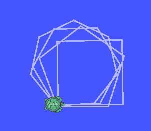
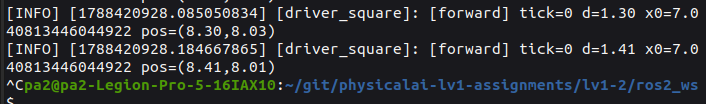
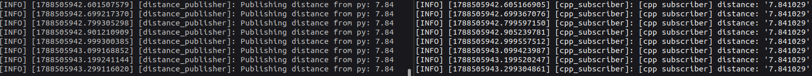
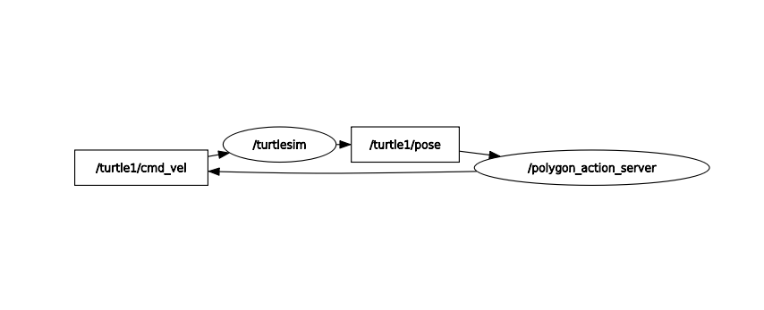
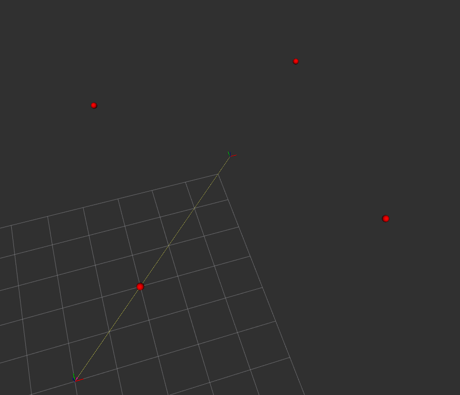

# 문제 1.

## 1. 수동 2단계 빌드 명령 (터미널 입력)
```
pa2@pa2-Legion-Pro-5-16IAX10:~/git/physicalai-lv1-assignments/lv1-2/cpp_basics$ g++ -Wall -std=c++17 stop_distance.cpp -o stop_distance
pa2@pa2-Legion-Pro-5-16IAX10:~/git/physicalai-lv1-assignments/lv1-2/cpp_basics$ ./stop_distance 
속도: 10
마찰: 2

5.09858
```

## 2. undefined reference 에러 메시지 (출력) — 컴파일 에러와의 차이 설명

컴파일은 되었지만 main안에 motor.hpp 선언만 있고 정의 부분이 motor.cpp 로 링크 되어야 하지만 그 파일을 지정 하지 않았기 때문에 undefined refernce 정의 되지 않음 에러가 난다.

```
pa2@pa2-Legion-Pro-5-16IAX10:~/git/physicalai-lv1-assignments/lv1-2/cpp_basics$ g++ main.o -o main
/usr/bin/ld: main.o: in function `main':
main.cpp:(.text+0x28): undefined reference to `Motor::Motor(unsigned int)'
collect2: error: ld returned 1 exit status
```

## 3. CMake 빌드 출력


```
pa2@pa2-Legion-Pro-5-16IAX10:~/git/physicalai-lv1-assignments/lv1-2/cpp_basics/build$ make
Consolidate compiler generated dependencies of target main
[ 33%] Building CXX object CMakeFiles/main.dir/main.cpp.o
[ 66%] Building CXX object CMakeFiles/main.dir/motor.cpp.o
[100%] Linking CXX executable main
[100%] Built target main
```

## 4. 증분 빌드 시 재컴파일된 파일

motor.cpp main.cpp

motor.cpp 만 수정 했지만 main.cpp 도 motor 를 참조 하고있기 때문에 재 컴파일 되었다. 증분 빌드의 단위는 소스파일.cpp 가 아니라 의존 하는 모든 파일이다.

# 문제 2.

## 1. 다형성 루프 출력

```
Lidar data would be here...
Imu data would be here...
```

## 2. 스택 객체와 힙 객체의 소멸 시점

종료 또는 블록 나오면 선언의 역순으로 정리됨. 클래스 내부에서는 종속의 역순으로 정리된다.

```
Lidar data would be here...
Imu data would be here...
~Lidar
~Sensor
~Imu
~Sensor
```

## 3. 가상 소멸자를 뺐을 때의 차이

가상 소멸자를 제거 했을때,
출력 안함.
```
Lidar data would be here...
Imu data would be here...
```
virtual 타입만 제거 했을때,
상속 받은 클래스 들은 소멸자 호출 안됨.
```
Lidar data would be here...
Imu data would be here...
~Sensor
~Sensor
```

## 4. `count_if` 결과

```
최근 lidar 측정값0.1, 0.2
최근 imu 측정값0.3, 0.4
0.5 이내 포인트 개수: 3
```

## 5. 누수 검출 결과

**fsanitize=address**
SUMMARY: 루프로 돌린 10개의 오브젝트 검출 new_delete 

```
=================================================================
==35687==ERROR: LeakSanitizer: detected memory leaks

Direct leak of 240 byte(s) in 10 object(s) allocated from:
    #0 0x7d36a0eb61e7 in operator new(unsigned long) ../../../../src/libsanitizer/asan/asan_new_delete.cpp:99
    #1 0x59b84b741b0d in main /home/sjh/git/physicalai-lv1-assignments/lv1-2/cpp_basics/sensors/main.cpp:105
    #2 0x7d36a0629d8f in __libc_start_call_main ../sysdeps/nptl/libc_start_call_main.h:58

SUMMARY: AddressSanitizer: 240 byte(s) leaked in 10 allocation(s).
```

수정 후 소멸자 전부 호출됨
```
./main_asan 
Lidar data would be here...
Imu data would be here...
최근 lidar 측정값0.1, 0.2
최근 imu 측정값0.3, 0.4
0.5 이내 포인트 개수: 3
clamp speed: 5
clamp pixel: 100
~Lidar
~Sensor
~Lidar
~Sensor
~Lidar
~Sensor
~Lidar
~Sensor
~Lidar
~Sensor
~Lidar
~Sensor
~Lidar
~Sensor
~Lidar
~Sensor
~Lidar
~Sensor
~Lidar
~Sensor
~Lidar
~Sensor
~Imu
~Sensor
```

**valgrind**
검출: in use at exit: 240 bytes in 10 blocks
```
==36999== HEAP SUMMARY:
==36999==     in use at exit: 240 bytes in 10 blocks
==36999==   total heap usage: 21 allocs, 11 frees, 74,400 bytes allocated
==36999== 
==36999== 240 bytes in 10 blocks are definitelylost in loss record 1 of 1
==36999==    at 0x4849013: operator new(unsigned long) (in /usr/libexec/valgrind/vgpreload_memcheck-amd64-linux.so)
==36999==    by 0x10AE43: main (in /home/sjh/git/physicalai-lv1-assignments/lv1-2/cpp_basics/sensors/main)
==36999== 
==36999== LEAK SUMMARY:
==36999==    definitely lost: 240 bytes in 10 blocks
==36999==    indirectly lost: 0 bytes in 0 blocks
==36999==      possibly lost: 0 bytes in 0 blocks
==36999==    still reachable: 0 bytes in 0 blocks
==36999==         suppressed: 0 bytes in 0 blocks
==36999== 
==36999== For lists of detected and suppressed errors, rerun with: -s
==36999== ERROR SUMMARY: 1 errors from 1 contexts (suppressed: 0 from 0)
```

std::make_unique 사용
```
==37257== HEAP SUMMARY:
==37257==     in use at exit: 0 bytes in 0 blocks
==37257==   total heap usage: 21 allocs, 21 frees, 74,400 bytes allocated
==37257== 
==37257== All heap blocks were freed -- no leaks are possible
==37257== 
==37257== For lists of detected and suppressed errors, rerun with: -s
==37257== ERROR SUMMARY: 0 errors from 0 contexts (suppressed: 0 from 0)
```

# 문제 3.

## 1. /turtle1/pose 필드

```
x: 5.544444561004639
y: 5.544444561004639
theta: 0.0
linear_velocity: 0.0
angular_velocity: 0.0
```

## 2. ros2 topic hz /turtle_distance 출력

```
average rate: 9.999
	min: 0.099s max: 0.101s std dev: 0.00034s window: 84
average rate: 9.999
	min: 0.099s max: 0.101s std dev: 0.00033s window: 95
average rate: 10.000
	min: 0.099s max: 0.101s std dev: 0.00034s window: 106
average rate: 10.000
	min: 0.099s max: 0.101s std dev: 0.00033s window: 117

```

## 3. 경고 로그
```
[WARN] [1788348962.936525683] [distance_watcher]: Distance 7.84 > 2.50!
```

## 4. 구독자 2개 동시 수신 확인


## 5. 정사각형 주행
다각형 가능


## 6. 정상 종료



# 문제 4.

## 1. colcon build 성공 출력

```
pa2@pa2-Legion-Pro-5-16IAX10:~/git/physicalai-lv1-assignments/lv1-2/ros2_ws$ colcon build --packages-select turtle_cpp
Starting >>> turtle_cpp
Finished <<< turtle_cpp [5.05s]                     

Summary: 1 package finished [5.25s]
```


## 2. rclpy 발행에서 rclcpp 구독으로 이어진 로그



## 3.

rclcpp, rclpy 에 함수와 클래스가 제공된다.

| | rclpy | rclcpp |
| --- | --- | --- |
| 노드 생성| class 노드이름(Node) | class 노드이름() : public rclcpp::Node |
| 타이머| self.create_timer(주기, 콜백 함수) |this->creat_wall_timer(주기, 콜백 함수) |
| 콜백 | class 내부 함수 | class 내부 public 멤버함수 |
| 종료 | node.destroy(), rclpy.shutdown() |rclcpp::shutdown() |


spin() 루프 진입 -> 이벤트(데이터, 타이머) -> executor(콜백) -> 콜백함수 실행 -> ... -> shutdown()


# 문제 5.

## 1. 호출한 내장 서비스와 타입

클라이언트에서 순서대로 호출한 4개 서비스. 타입은 `ros2 service type <이름>` 으로 확인했다.

| 서비스 | 타입 | 요청 값 | 결과 |
| --- | --- | --- | --- |
| /turtle1/teleport_absolute | turtlesim/srv/TeleportAbsolute | x=6.5, y=5.5, theta=0.0 | 지정 절대 좌표로 순간이동 |
| /turtle1/set_pen | turtlesim/srv/SetPen | r=255, g=0, b=0, width=4, off=0 | 펜을 빨강·굵기 4로 설정 |
| /spawn | turtlesim/srv/Spawn | x=2.0, y=2.0, theta=0.0, name=turtle2 | 새 거북이 이름 반환 |
| /clear | std_srvs/srv/Empty |  | 궤적 삭제 |

teleport·set_pen·spawn 은 turtlesim 전용 타입(`turtlesim/srv/*`)이고, clear 는 요청·응답 필드가 모두 없는 공용 타입 `std_srvs/srv/Empty` 다.


## 2. Service 요청·응답 로그

teleport_absolute x = 6.5 로 이동
```
ros2 service call /turtle1/teleport_absolute turtlesim/srv/TeleportAbsolute "{x: 6.5, y: 5.5, theta: 0.0}"
requester: making request: turtlesim.srv.TeleportAbsolute_Request(x=6.5, y=5.5, theta=0.0)

response:
turtlesim.srv.TeleportAbsolute_Response()
```

## 3. 데드락이 생기는 이유

노드 내부 executor(싱글 스레드 - 한번에 하나 실행) 에서 발행, 구독, 서비스 액션의 콜백을 다루는데, executor 가 서비스의 응답을 기다리고 있고 그 서비스는 콜백의 응답을 기다리고 있을때 노드가 멈춰 버린다.

## 4. rotate_absolute 피드백 수신 로그 

```
ros2 run turtle_examples ex05_rotate_absolute_client
[INFO] [1788687276.054480744] [rotate_absolute_client]: goal 전송: theta = 1.571 rad (현재 theta = None)
[INFO] [1788687276.058677480] [rotate_absolute_client]: goal 수락됨 — 피드백 대기
[INFO] [1788687276.059330280] [rotate_absolute_client]: 피드백: remaining = +1.571 rad
[INFO] [1788687276.314981763] [rotate_absolute_client]: 피드백: remaining = +1.315 rad
[INFO] [1788687276.570805230] [rotate_absolute_client]: 피드백: remaining = +1.059 rad
[INFO] [1788687276.827257632] [rotate_absolute_client]: 피드백: remaining = +0.803 rad
[INFO] [1788687277.082700713] [rotate_absolute_client]: 피드백: remaining = +0.547 rad
[INFO] [1788687277.338853340] [rotate_absolute_client]: 피드백: remaining = +0.291 rad
[INFO] [1788687277.594770073] [rotate_absolute_client]: 피드백: remaining = +0.035 rad
[INFO] [1788687277.611733241] [rotate_absolute_client]: 결과 수신: status=SUCCEEDED, delta=-1.552 rad, 현재 theta = 1.5520000457763672
```

## 5. 취소 요청 처리 로그

```
 ros2 run turtle_examples ex05_rotate_absolute_client --theta 0 --cancel-after 1.0
[INFO] [1788688010.187770394] [rotate_absolute_client]: goal 전송: theta = 0.000 rad (현재 theta = None)
[INFO] [1788688010.203020889] [rotate_absolute_client]: 피드백: remaining = -3.136 rad
[INFO] [1788688010.203444016] [rotate_absolute_client]: goal 수락됨 — 피드백 대기
[INFO] [1788688010.459136741] [rotate_absolute_client]: 피드백: remaining = -2.880 rad
[INFO] [1788688010.714585085] [rotate_absolute_client]: 피드백: remaining = -2.624 rad
[INFO] [1788688010.970535866] [rotate_absolute_client]: 피드백: remaining = -2.368 rad
[WARN] [1788688011.204395943] [rotate_absolute_client]: 취소 요청 전송 (요청 시점 theta = 2.128 rad)
[WARN] [1788688011.211161590] [rotate_absolute_client]: 취소 수락됨 (서버가 중단 처리 중). 취소 시점 theta = 2.128 rad
[INFO] [1788688011.212255131] [rotate_absolute_client]: 결과 수신: status=CANCELED, delta=+0.992 rad, 현재 theta = 2.128000020980835
```

## 6. 통신 패턴 설계표

| 기능 | 선택한 모델 | 근거 |
| --- | --- | --- |
| 자세 스트리밍 | Topic | 계속 흐르는 데이터를 여러 구독자에 브로드캐스트, 응답 불필요. |
| 순간이동 | Service | 즉시 끝나는 1회 요청-응답. |
| 펜 색 설정 | Service | 즉시 끝나는 설정 변경 요청-응답. |
| 거북이 추가 | Service | 1회 요청 후 이름을 응답으로 받고 즉시 완료. |
| 목표 각도까지 회전 | Action | 오래 걸리는 작업 + 피드백(remaining) + 취소 필요. |

계속 흐르는 데이터는 Topic,
짧게 끝나는 요청,응답은 Service,
오래 걸리며 피드백,취소가 필요한 작업은 Action.

# 문제 6.

## 1. ros2 interface show turtle_interfaces/msg/WaypointList 출력

```
# 문제 6 — 경유점 목록. "중첩(다른 메시지를 필드로)" 과 "배열" 을 모두 사용합니다.
#
# 다른 패키지의 메시지를 쓸 때는 "패키지/타입" 으로 적습니다 (std_msgs/Header).
# 같은 패키지의 메시지는 패키지 이름 없이 타입 이름만 적어도 됩니다 (Waypoint).
# Waypoint[] 처럼 [] 를 붙이면 가변 길이 배열이 됩니다. (고정 길이는 Waypoint[4])

std_msgs/Header header   # stamp(발행 시각) + frame_id(좌표계 이름, 여기서는 "world")
	builtin_interfaces/Time stamp
		int32 sec
		uint32 nanosec
	string frame_id
Waypoint[] waypoints     # 경유점 배열 — 문제 6 에서는 4개 이상을 채워 발행합니다
	float64 x            # 경유점 x 좌표 [m] (turtlesim 좌표계, 0 ~ 1
	float64 y            #
	float32 tolerance    # 도달 판정 허용 오차 [m] — 이 거리 이내면 "도달" 로 봅
	string  label        #

```

## 2. ros2 topic echo /waypoints 출력 

```
ros2 topic echo /waypoints
header:
  stamp:
    sec: 1788701530
    nanosec: 2251524
  frame_id: world
waypoints:
- x: 2.0
  y: 2.0
  tolerance: 0.30000001192092896
  label: corner_A
- x: 9.0
  y: 2.0
  tolerance: 0.30000001192092896
  label: corner_B
- x: 9.0
  y: 9.0
  tolerance: 0.30000001192092896
  label: corner_C
- x: 2.0
  y: 9.0
  tolerance: 0.30000001192092896
  label: corner_D
---
```

## 3. DrawPolygon 피드백 로그

```
ros2 action send_goal /draw_polygon turtle_interfaces/action/DrawPolygon "{sides: 3, side_length: 2.0}" --feedback
Waiting for an action server to become available...
Sending goal:
     sides: 3
side_length: 2.0

Goal accepted with ID: c9781cda008944dcab7576f99eb1cd80

Feedback:
    completed_sides: 1
progress: 0.3333333432674408

Feedback:
    completed_sides: 2
progress: 0.6666666865348816

Feedback:
    completed_sides: 3
progress: 1.0

Result:
    total_distance: 6.029753619544511

Goal finished with status: SUCCEEDED

```

## 4. 삼각형·오각형·팔각형 궤적 캡처 (이미지 3장)





## 5. 액션 취소 처리 결과

```
[INFO] [1788703233.707537550] [polygon_action_server]: 다각형 완성: 총 이동 거리 10.04 m
[INFO] [1788703263.519158583] [polygon_action_server]: goal 수락: sides=8, side_length=2.0
[INFO] [1788703267.891848809] [polygon_action_server]: 변 1/8 완료 (누적 2.01 m)
[INFO] [1788703272.312516957] [polygon_action_server]: 변 2/8 완료 (누적 4.02 m)
[WARN] [1788703272.313003136] [polygon_action_server]: 취소 요청 수신 — 실행 루프에서 즉시 정지합니다
[WARN] [1788703272.364075489] [polygon_action_server]: 취소됨 — 정지. 그때까지 이동 거리 4.02 m

```

## 6. 인터페이스를 별도 패키지로 분리하는 이유

여러 노드가 하나의 인터페이스를 사용할 수 있기 때문에. 노드랑 같이 패키징 된다면 다른 노드들이 인터페이스를 사용 할때 불필요한 패키지에 의존 하게 된다.